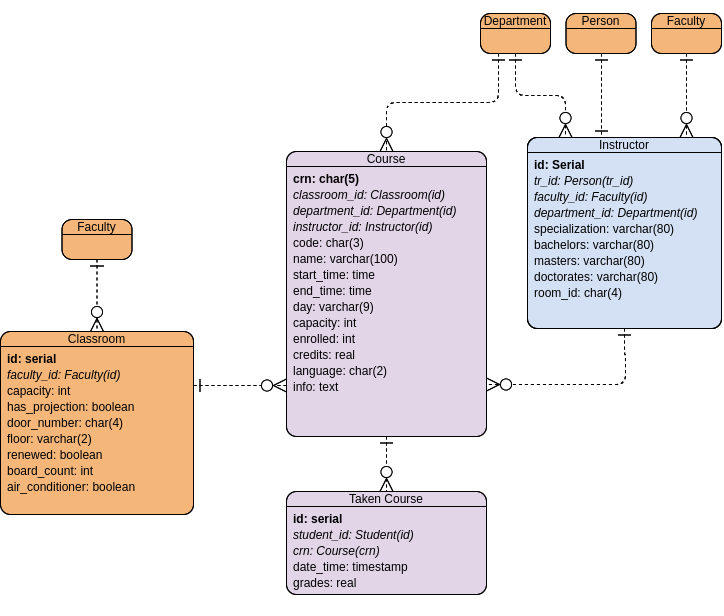
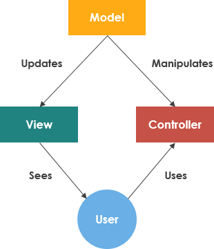

Developer Guide
===============

Database Design
---------------

**explain the database design of your project**

E/R Diagrams of DataBees
++++++++++++++++++++++++

.. figure:: ../../images/databees_erd_derinbay.png
    :alt: ERD of Derinbay
    :align: center

.. figure:: ../../images/zeynepyetistiren_ERD.png
    :alt: ERD of Yetistiren
    :align: center

Code
----

ITU DataBees integrates the **model-view-controller** design.

- **Web Framework:** Flask
- **Database:** PostgreSQL
- **Written in:** Python

    Model-View-Controller

ITU DataBees is structed as follows:

- ``server.py`` creates a flask app, handles the incoming requests and routes them.
- ``views.py`` renders the templates.
- ``database.py`` handles the requests between the database and the web application.
- ``settings.py`` has the settings for the flask web application.
- ``dbinit.py`` initializes the DataBees.
- ``forms.py`` handles the forms controlled by flask forms.
- Various class named files includes corresponding python classes and related functions.
- Templates folder contains the HTML files of the websites
- Static folders contains the images, style sheets and scripts used during the development of the DataBees.

.. toctree::

   Batuhan Faik Derinbay
   fatih
   Zeynep Yetistiren
   Cihat Akkiraz
