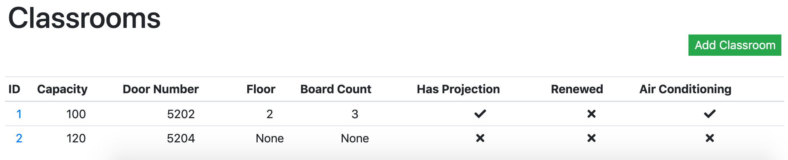

Parts Implemented by Cihat Akkiraz
================================

Campus, Faculty and Department pages implemented by this team member will be explained here.

.. warning::
    To execute operations that will be mentioned below, you have to have administrator permissions. 
    So, only members who are given the admin role when they are created can see and access the campus management part in the navbar.

.. figure:: ../../images/akkiraz/campus_management_navbar.png
    :alt: Campus Management On Navbar
    :align: center

Campus
------

When you click on the 'management' option in the Navbar, 
you can access the campus management page by clicking on the 'campus' 
in the dropdown menu that opens.

In this page, admins can create new Campuses and display existing campuses.
Also there delete or edit existing campuses.

Creating Campuses
*****************

.. figure:: ../../images/akkiraz/create_new_campus.png
    :alt: Create New Campus
    :align: center

Displaying Existing Campuses
++++++++++++++++++++++++++++

.. figure:: ../../images/akkiraz/display_existing_campuses.png
    :alt: Display Existing Campuses
    :align: center

.. figure:: ../../images/akkiraz/redirect_edit_campus_page.png
    :alt: Redirect Edit Campus Page
    :align: center

Detailed View For Custom Campus
*******************************

.. figure:: ../../images/akkiraz/campus_edit_1.png
    :alt: Detailed View For Custom Campus
    :align: center    

Editing Campus
++++++++++++++

.. figure:: ../../images/akkiraz/campus_edit_2.png
    :alt: Edit Campus
    :align: center 

.. figure:: ../../images/akkiraz/campus_edit_3.png
    :alt: Edit Campus
    :align: center

In this page faculties that are in campus can be listed and create new faculties.
How this can be done is mentioned in detail there.

Removing Campus
***************

.. figure:: ../../images/akkiraz/remove_campus_warning.png
    :alt: Remove Warning For Campus
    :align: center

Faculty
------

When you click on the 'management' option in the Navbar, 
you can access the faculty management page by clicking on the 'faculty' 
in the dropdown menu that opens.

In this page, admins can create new Campuses and display existing faculties.
Also there delete or edit existing faculties.

Creating Faculty
*****************

.. figure:: ../../images/akkiraz/create_new_faculty.png
    :alt: Create New Faculty
    :align: center

Displaying Existing Faculties
++++++++++++++++++++++++++++

.. figure:: ../../images/akkiraz/display_existing_faculties.png
    :alt: Display Existing Faculties    
    :align: center

.. figure:: ../../images/akkiraz/redirect_edit_faculty_page.png
    :alt: Redirect Edit Faculty Page
    :align: center

Detailed View For Custom Faculty
*******************************  

.. figure:: ../../images/akkiraz/faculty_edit_1.png
    :alt: Detailed View For Custom Faculty
    :align: center    

Editing Faculty
++++++++++++++

.. figure:: ../../images/akkiraz/faculty_edit_2.png
    :alt: Edit Faculty
    :align: center 

Listing Classrooms in faculty
*****************************

Removing Faculty
++++++++++++++++

.. figure:: ../../images/akkiraz/remove_faculty_warning.png
    :alt: Display Existing Faculties
    :align: center

Department
------

When you click on the 'management' option in the Navbar, 
you can access the department management page by clicking on the 'department' 
in the dropdown menu that opens.

In this page, admins can create new Departments and display existing departments.
Also there delete or edit existing departments.

Creating Departments
*****************

.. figure:: ../../images/akkiraz/create_new_department.png
    :alt: Create New Department
    :align: center

Displaying Existing Departments
++++++++++++++++++++++++++++

.. figure:: ../../images/akkiraz/display_existing_departments.png
    :alt: Display Existing Departments
    :align: center

.. figure:: ../../images/akkiraz/redirect_edit_department_page.png
    :alt: Redirect Edit Department Page
    :align: center

Detailed View For Custom Department
*******************************

.. figure:: ../../images/akkiraz/department_edit_1.png
    :alt: Detailed View For Custom Department
    :align: center    

Editing Department
++++++++++++++

.. figure:: ../../images/akkiraz/department_edit_2.png
    :alt: Edit Department
    :align: center 

.. figure:: ../../images/akkiraz/department_edit_3.png
    :alt: Edit Department
    :align: center

In this page faculties that are in department can be listed and create new faculties.
How this can be done is mentioned in detail there.

Removing Department
***************

.. figure:: ../../images/akkiraz/remove_department_warning.png
    :alt: Remove Warning For Department
    :align: center
