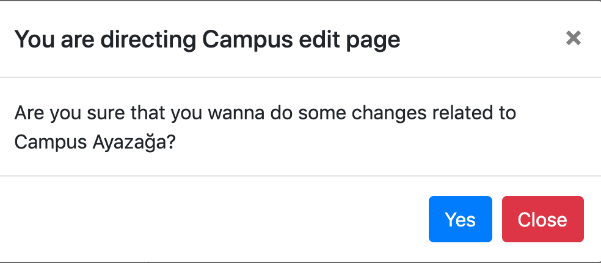
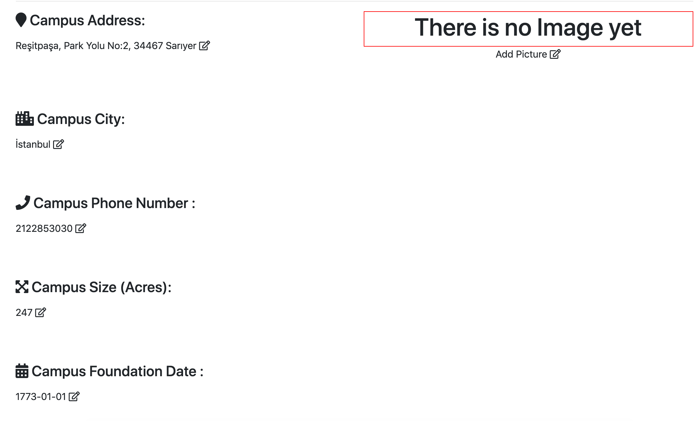
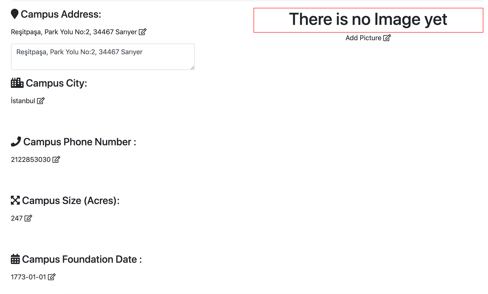
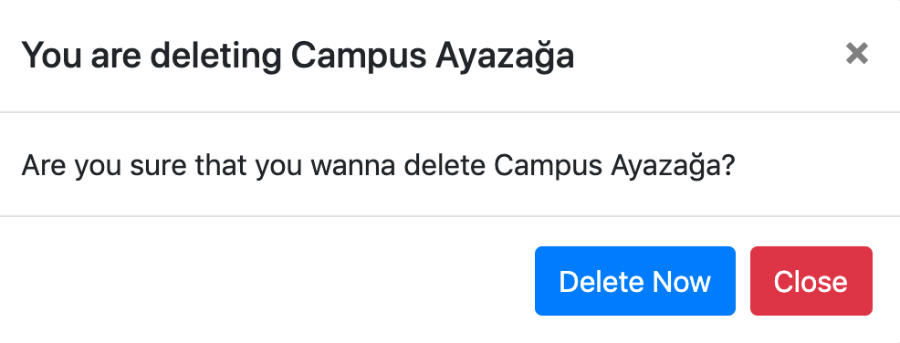
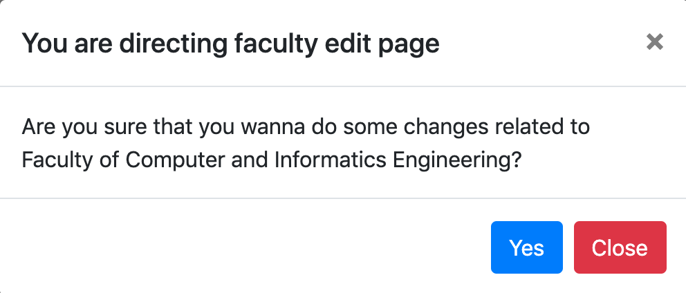
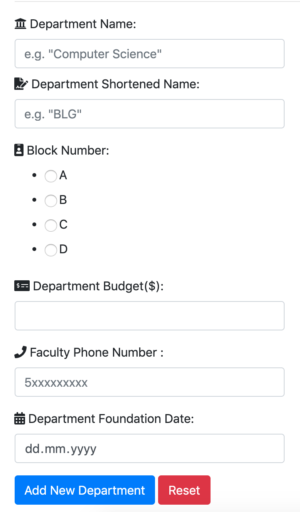
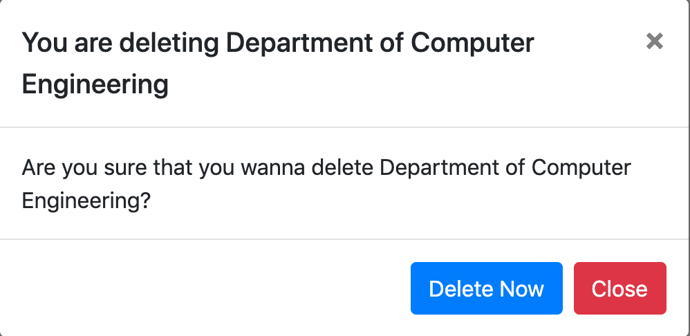

Parts Implemented by Cihat Akkiraz
================================

Campus, Faculty and Department pages implemented by this team member will be explained here.

.. warning::
    To execute operations that will be mentioned below, you have to have administrator permissions. 
    So, only members who are given the admin role when they are created can see and access the campus management part in the navbar.

When you click on the 'management' option in the Navbar, 
you can access the campus management pages by clicking on the 'campuses' 
in the dropdown menu that opens.

Campus
------

In this page, admins can create new Campuses and display existing campuses.
Also they can delete or edit existing campuses.

Creating Campus
*****************

In this part, the user can create filling a form about new campus. When filling out this form, the user should pay attention to the following.

- Campus name cannot be longer than 50 characters.
- Campus address cannot be longer than 80 characters.

.. figure:: ../../images/akkiraz/create_new_campus.png
    :alt: Create New Campus
    :align: center

After filling this form if the form is valid, new campus will be created.

Displaying Existing Campuses
++++++++++++++++++++++++++++

There is a section for listing existing campuses, in the right of the create campus form.
This list consists 'Campus Name', 'Campus Phone Number', edit icon and remove icon for each campus.

.. figure:: ../../images/akkiraz/display_existing_campuses.png
    :alt: Display Existing Campuses
    :align: center

Clicking edit icon will display a warning about redirecting edit page.

Detailed View For Custom Campus
*******************************

When you click edit page icon you will be redirected edit campus page. In this page you can
display all attributes of desired campus. 

Editing Campus
++++++++++++++

There is a edit icon for each campus attributes. Clicking this edit icon will make edit form for desired attribute visible.

After editing desired attributes, you can click 'Save All Changes' button to save all changes.
In case you wanna discard all changes, you can click 'Discard all Changes' buttton.

.. figure:: ../../images/akkiraz/campus_edit_3.png
    :alt: Edit Campus
    :align: center

Below these 2 components, there is a section for managing faculties in this campus.
This two sections will be mentioned Faculty part of the documentation

Removing Campus
***************

In the campus list component, there is a remove icon. Clicking this remove campus icon will display remove campus warning.

When you click 'Delete Now' button, the campus and all things related to this campus will be deleted.

Faculty
------

In the edit campus page, there is a section for creating new faculty and listing existing faculties.

Creating Faculty
*****************

In this part, the user can create filling a form about new faculty. When filling out this form, the user should pay attention to the following.

- Faculty name cannot be longer than 100 characters.
- Faculty shortened name cannot be longer than 6 characters.
- Faculty address cannot be longer than 80 characters.
- Faculty phone number cannot be longer than 11 characters.

.. figure:: ../../images/akkiraz/create_new_faculty.png
    :alt: Create New Faculty
    :align: center

Displaying Existing Faculties
++++++++++++++++++++++++++++

There is a section for listing existing faculties, in the right of the create faculty form.
This list consists 'Faculty Name', 'Faculty Phone Number','Faculty Shortened Name', edit icon and remove icon for each faculty.

.. figure:: ../../images/akkiraz/display_existing_faculties.png
    :alt: Display Existing Faculties 
    :align: center

Clicking edit icon will display a warning about redirecting edit page.

Detailed View For Custom Faculty
*******************************  

When you click edit page icon you will be redirected edit faculty page. In this page you can
display all attributes of desired faculty. 

.. figure:: ../../images/akkiraz/faculty_edit_1.png
    :alt: Detailed View For Custom Faculty
    :align: center    

Editing Faculty
++++++++++++++

There is a edit icon for each faculty attributes. Clicking this edit icon will make edit form for desired attribute visible.

.. figure:: ../../images/akkiraz/faculty_edit_2.png
    :alt: Edit Faculty
    :align: center 

After editing desired attributes, you can click 'Save All Changes' button to save all changes.
In case you wanna discard all changes, you can click 'Discard all Changes' buttton.

Below these 2 components, there is a section for managing departments in this faculty.
This two sections will be mentioned Department part of the documentation

Removing Faculty
++++++++++++++++

In the faculty list component, there is a remove icon. Clicking this remove campus icon will display remove campus warning.

.. figure:: ../../images/akkiraz/remove_faculty_warning.png
    :alt: Display Existing Faculties
    :align: center

Department
------

In this page, admins can create new departments and display existing departments.
Also they can delete or edit existing departments.

Creating Department
*****************

In this part, the user can create filling a form about new department. When filling out this form, the user should pay attention to the following.

- Department name cannot be longer than 100 characters.
- Department shortened name cannot be longer than 6 characters.

After filling this form if the form is valid, new department will be created.

Displaying Existing Departments
++++++++++++++++++++++++++++

There is a section for listing existing departments, in the right of the create department form.
This list consists 'Department Name','Shortened Name', 'Block Number','Phone Number', edit icon and remove icon for each department.

.. figure:: ../../images/akkiraz/display_existing_departments.png
    :alt: Display Existing Departments
    :align: center

Clicking edit icon will display a warning about redirecting edit page.

.. figure:: ../../images/akkiraz/redirect_edit_department_page.png
    :alt: Redirect Edit Department Page
    :align: center

Detailed View For Custom Department
*******************************

When you click edit page icon you will be redirected edit department page. In this page you can
display all attributes of desired department. 

.. figure:: ../../images/akkiraz/department_edit_1.png
    :alt: Detailed View For Custom Department
    :align: center    

Editing Department
++++++++++++++

There is a edit icon for each department attributes. Clicking this edit icon will make edit form for desired attribute visible.

.. figure:: ../../images/akkiraz/department_edit_2.png
    :alt: Edit Department
    :align: center 

After editing desired attributes, you can click 'Save All Changes' button to save all changes.
In case you wanna discard all changes, you can click 'Discard all Changes' buttton.

    
Removing Department
***************

In the department list component, there is a remove icon. Clicking this remove department icon will display remove department warning.

When you click 'Delete Now' button, the department and all things related to this department will be deleted.
